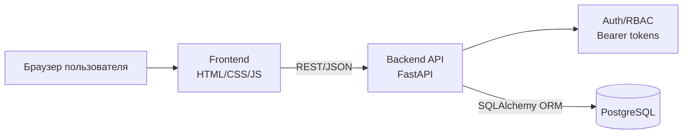
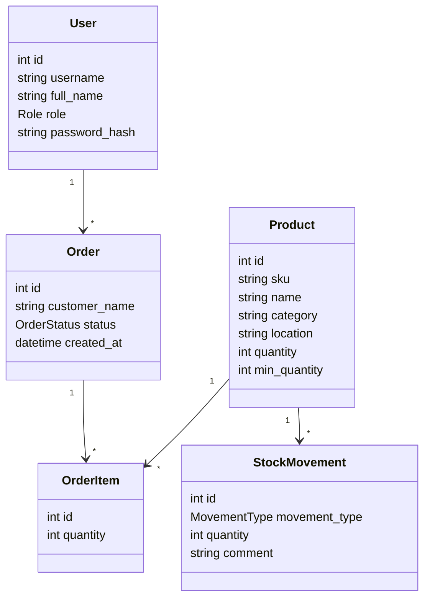
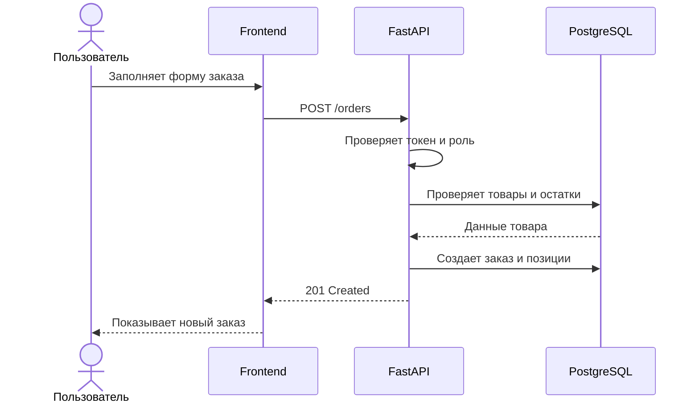

# Архитектура системы

## Выбранная архитектура

Приложение построено как трехзвенная клиент-серверная система:

1. Клиент: статический HTML/CSS/JavaScript интерфейс, работающий в браузере.
2. Сервер: Python FastAPI REST API с ролевой авторизацией.
3. Данные: PostgreSQL, хранящий пользователей, товары, складские движения, заказы и позиции заказов.

## UML: диаграмма компонентов

## UML: модель предметной области

## UML: сценарий создания заказа

