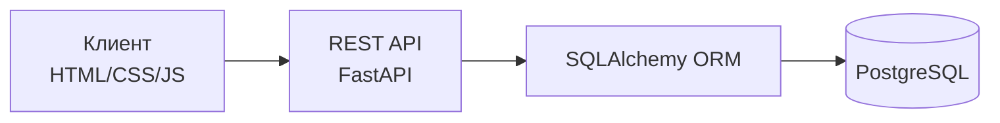
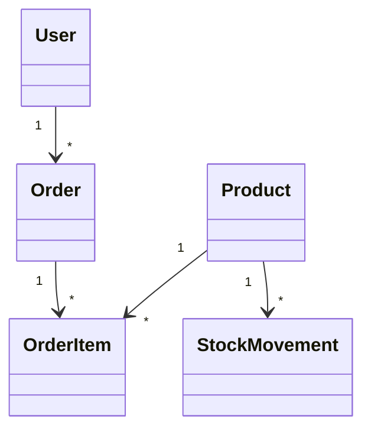

# Презентация: МаркетПульс

## 1. Тема и цель

Разработка клиент-серверного CRUD-приложения для учета складских остатков, движений товаров, заказов и пользователей.

## 2. Анализ предметной области

На складе требуется вести справочник товаров, контролировать остатки, фиксировать приход и расход, создавать заказы клиентов и ограничивать действия сотрудников по ролям.

Ключевые роли:
- admin: управление пользователями и всеми сущностями.
- manager: управление товарами, движениями и статусами заказов.
- clerk: просмотр данных и создание заказов.

## 3. Архитектура



## 4. Программный стек

- Backend: Python, FastAPI, SQLAlchemy, Pydantic.
- Database: PostgreSQL 16.
- Frontend: HTML, CSS, JavaScript.
- Testing: pytest, Hypothesis.
- Delivery: Docker, Docker Compose.

## 5. Функции приложения

- Авторизация пользователя.
- Ролевая модель доступа.
- CRUD товаров.
- Создание и обработка заказов.
- Учет складских движений.
- Валидация некорректных ролей, SKU, отрицательных остатков и превышения доступного количества.

## 6. ER/UML модель



## 7. Фаззинг-тестирование

Для фаззинга используется Hypothesis. Проверяются:
- неизвестные роли пользователей;
- отрицательные остатки товаров;
- некорректные SKU.

## 8. Развертывание

Локальный запуск:

```bash
docker compose up --build
```

Облачный вариант:
- Render/Fly.io/Railway для API;
- PostgreSQL managed database;
- любой static hosting для frontend или nginx-контейнер.
